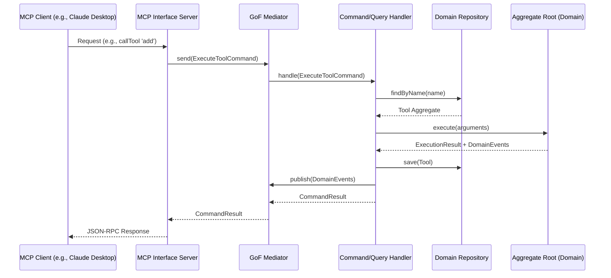

# Architecture Documentation (oreo-pudding)

This document describes the architectural style, design patterns, and structure of the **oreo-pudding** MCP server.

This project is built using a **Zealous Approach** to Domain-Driven Design (DDD), Command Query Responsibility Segregation (CQRS), and Gang of Four (GoF) Design Patterns.

---

## 1. Architectural Layers

The codebase is organized into four distinct layers, enforcing a strict dependency flow: **Interface -> Application -> Infrastructure -> Domain**.

```
┌─────────────────────────────────────────────────────────┐
│                    Interface Layer                      │
│        (MCP Protocol, JSON-RPC, CLI Bootstrapping)      │
└────────────────────────────┬────────────────────────────┘
                             │ (uses)
                             ▼
┌─────────────────────────────────────────────────────────┐
│                    Application Layer                    │
│   (Commands, Queries, CQRS Mediator, DTOs, Handlers)   │
└────────────────────────────┬────────────────────────────┘
                             │ (uses)
                             ▼
┌─────────────────────────────────────────────────────────┐
│                  Infrastructure Layer                   │
│   (InMemoryRepositories, EventDispatcher, SDK Adapters) │
└────────────────────────────┬────────────────────────────┘
                             │ (implements/uses)
                             ▼
┌─────────────────────────────────────────────────────────┐
│                      Domain Layer                       │
│    (Aggregate Roots, Entities, Value Objects, Events)   │
└─────────────────────────────────────────────────────────┘
```

- **Domain Layer (`src/domain/`)**: The pure core containing the business rules. It has *zero dependencies* on external libraries, frameworks, or web technologies. It is defined solely in TypeScript.
- **Application Layer (`src/application/`)**: Orchestrates the application flow. It contains the use cases, modeled as Commands and Queries, routed by a custom CQRS Mediator to their respective Handlers.
- **Infrastructure Layer (`src/infrastructure/`)**: Implements concrete storage mechanisms (e.g., repositories) and messaging (e.g., event dispatching).
- **Interface Layer (`src/interface/`)**: The entry point. Handles the Model Context Protocol (MCP) JSON-RPC protocol, adapting incoming requests to Commands/Queries and dispatching them through the Mediator.

---

## 2. Domain-Driven Design (DDD)

We use DDD to align our technical design with the business model of an MCP server.

### Seedwork Concepts (`src/domain/seedwork/`)
- **Entity**: An object defined by its identity rather than its attributes. Entities are mutable but maintain a persistent ID.
- **Value Object**: An immutable object defined by its attributes rather than identity. Two Value Objects are equal if all their fields match.
- **Aggregate Root**: A cluster of associated objects (entities and value objects) treated as a single unit for data changes. All external interactions must go through the Aggregate Root.
- **Domain Event**: Something unique and meaningful that happened in the domain (e.g., `ToolRegisteredEvent`). Events are published by the Aggregate Root and dispatched by the Infrastructure layer.

### Bounded Context: MCP Registry
Our primary Bounded Context is the **MCP Registry**, which governs the registration, query, and execution of tools, prompts, and resources.
- **Tool Aggregate**:
  - `Tool` (Aggregate Root): Represents an executable MCP tool.
  - `ToolId` (Value Object): Strong typed identifier.
  - `ToolName` (Value Object): Validated name conforming to MCP regex `/^[a-zA-Z0-9_-]+$/`.
  - `ToolDescription` (Value Object): Strong-typed description.
  - `ToolSchema` (Value Object): The JSON schema defining input parameters.
  - `ToolStrategy` (Value Object / Strategy): Represents the actual execution logic.

---

## 3. CQRS (Command Query Responsibility Segregation)

To maximize decoupling, we separate actions that change state (Commands) from actions that read state (Queries).

- **Commands (Write Side)**:
  - Do not return data (except perhaps a minimal identifier or success status).
  - Modify aggregate state.
  - Example: `RegisterToolCommand`, `ExecuteToolCommand`.
- **Queries (Read Side)**:
  - Never modify state.
  - Return read-optimized Data Transfer Objects (DTOs).
  - Example: `ListToolsQuery`.

### Command/Query Request Flow


---

## 4. Gang of Four (GoF) Design Patterns

Our architecture employs GoF patterns to maintain flexibility, decoupling, and strict single-responsibility principles:

### A. Mediator Pattern (Behavioral)
Used to implement our CQRS Command/Query Bus. Instead of the Interface Layer directly calling specific Handlers or Repositories, it dispatches commands/queries to the `Mediator`. The `Mediator` resolves and routes the request to its registered `Handler`.
*Code location*: [Mediator](file:///Users/ajspurlock/git/wizards/oreo-pudding/src/application/mediator/Mediator.ts)

### B. Strategy Pattern (Behavioral)
Different tools have different execution logics. Rather than using large switch cases or hardcoded branching, each `Tool` aggregate is instantiated with a specific `ToolStrategy`. When the tool is executed, it delegates execution to its strategy.
*Code location*: [ToolStrategy](file:///Users/ajspurlock/git/wizards/oreo-pudding/src/domain/tool/ToolStrategy.ts)

### C. Observer Pattern (Behavioral)
Used for **Domain Event Dispatching**. Aggregate roots compile domain events during execution. The `EventDispatcher` implements the Observer pattern, where event handlers subscribe to specific domain events (e.g., `ToolExecutedEvent`) and execute side effects asynchronously.
*Code location*: [EventDispatcher](file:///Users/ajspurlock/git/wizards/oreo-pudding/src/infrastructure/events/EventDispatcher.ts)

### D. Builder Pattern (Creational)
Used to construct complex, valid JSON Schema definitions for Tool input parameters, avoiding error-prone manual JSON object construction.
*Code location*: [ToolSchemaBuilder](file:///Users/ajspurlock/git/wizards/oreo-pudding/src/domain/tool/ToolSchemaBuilder.ts)

### E. Factory Method Pattern (Creational)
Used to instantiate entities and aggregate roots (e.g., `ToolFactory`) to ensure all invariants are validated before object construction, preventing the creation of invalid domain models.
*Code location*: [ToolFactory](file:///Users/ajspurlock/git/wizards/oreo-pudding/src/domain/tool/ToolFactory.ts)

### F. Decorator Pattern (Structural)
Used to wrap Command and Query handlers with cross-cutting concerns like validation, logging, and performance timing. This keeps the core handlers completely focused on business logic.
*Code location*: [LoggingHandlerDecorator](file:///Users/ajspurlock/git/wizards/oreo-pudding/src/application/decorators/LoggingHandlerDecorator.ts)

### G. Adapter Pattern (Structural)
Adapts the `@modelcontextprotocol/sdk` classes (`Server`, `CallToolRequestSchema`, etc.) to our clean architecture. The MCP Server acts as an adapter, translating incoming JSON-RPC calls into CQRS messages.
*Code location*: [McpServerAdapter](file:///Users/ajspurlock/git/wizards/oreo-pudding/src/interface/mcp/McpServerAdapter.ts)

---

## 5. In-Memory SWR (Stale-While-Revalidate) Caching

To optimize performance and minimize redundant CalDAV network requests, the Infrastructure layer implements an **In-Memory Stale-While-Revalidate (SWR)** caching mechanism inside `CalDavRepository`.

- **Caching Strategy**: 
  - Calendar discovery responses are cached with a TTL of 48 hours.
  - Event query responses and individual event lookups are cached with a TTL of 5 minutes.
- **Asynchronous Revalidation**: When a request matches a cache entry that is older than the TTL, the repository returns the stale cached data immediately to ensure a fast response time, while spawning an asynchronous background fetch to revalidate and update the cache in memory.
- **Propagation of Caching Metadata**: Read query handlers propagate `_swr` metadata containing `cachedAt`, `staleAt`, and `isStale` information. The `RetrieveAllCalendarEventsQueryHandler` aggregates the SWR metadata across the individual parallel calendar fetches to present a unified cache age and staleness state.

---

## 6. Directory Blueprint

```
src/
├── domain/                  # Pure Business Logic
│   ├── seedwork/            # DDD Core Base Classes (Entity, ValueObject, AggregateRoot)
│   └── tool/                # Tool Aggregate Root, Value Objects, Interfaces, and Strategies
│
├── application/             # Use Cases & CQRS Orchestration
│   ├── seedwork/            # CQRS Bus Interfaces (Command, Query, Handler, Mediator)
│   ├── mediator/            # Custom Mediator Implementation
│   ├── decorators/          # GoF Decorators (Logging, Performance, Validation)
│   └── tool/                # Tool Command/Query Handlers & DTOs
│
├── infrastructure/          # Data Access & External Integrations
│   ├── repository/          # Concrete Repositories (In-Memory implementation)
│   └── events/              # Event Dispatcher (Observer Pattern)
│
└── interface/               # Entry Points
    └── mcp/                 # MCP Server Adapter & Bootstrapping
```
